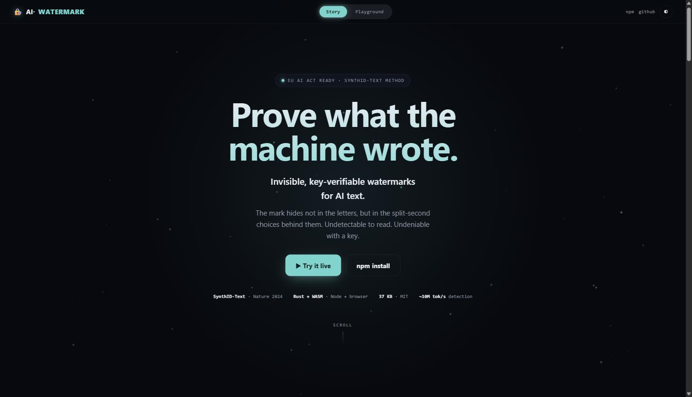
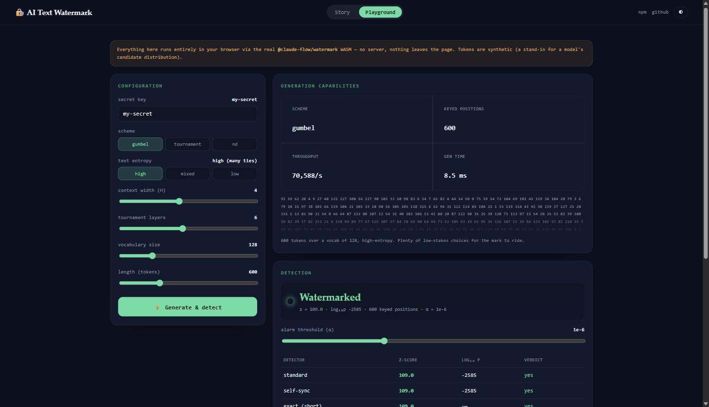

<div align="center">

# 🔏 AI Text Watermark

### Invisible, key-verifiable watermarks for LLM-generated text — in Rust + WebAssembly.

**Generate** a watermark that rides the model's own word choices, then **detect** it later with a secret key. SynthID-Text-style provenance for AI content — no extra tokens, no quality loss, Node **and** browser.

[](https://www.npmjs.com/package/@claude-flow/watermark)
[](https://crates.io/crates/ruflo-watermark)
[](./LICENSE)
[](#install)

**[▶ Live demo & playground](https://ruvnet.github.io/ai-text-watermark/)** · **[How it works](https://ruvnet.github.io/ai-text-watermark/#story)** · **[npm](https://www.npmjs.com/package/@claude-flow/watermark)** · **[crate](https://crates.io/crates/ruflo-watermark)**

</div>

---

> **AI text watermarking** marks machine-generated writing so it can be recognised later — a requirement of the **EU AI Act** (in force Aug 2026) that major providers, including Anthropic (SynthID-Text), are adopting. This library implements that method as a fast, embeddable WASM module and Rust crate, with an interactive playground.



## Why watermark AI text?

You can't stamp a logo on a sentence. AI text watermarking hides an **invisible, statistical signature** in the low-stakes word choices a model already makes — undetectable to a reader, but provable to anyone holding the key. It answers one question: *was a keyed model likely involved?* It carries **no user information** and is **not** a way to hide that AI was used.

- ✅ **No quality loss, no extra tokens, no added latency** — the mark lives in ties between equally-plausible words.
- ✅ **Key-verifiable** — a wrong key sees nothing; the mark identifies the *model/provider*, never a person.
- ✅ **Node + browser** via WebAssembly — nothing to compile.
- ✅ **Honest about limits** — short/factual/code text carries little mark; confidence grows with length.
- 🚫 **No removal / laundering tool** — this library only *writes* and *checks* marks.

## Install

**JavaScript / TypeScript (npm):**

```bash
npm install @claude-flow/watermark
# or the standalone name (thin wrapper, same API):
npm install ai-text-watermark
```

**Rust (crates.io):**

```bash
cargo add ruflo-watermark
```

## Quick start

### Node

```js
const { Watermarker, detect } = require('@claude-flow/watermark');

// You supply the model's candidate token ids + probabilities each step;
// the watermarker returns which candidate to emit.
const wm = new Watermarker({ key: 'my-secret', scheme: 'gumbel' });
const out = new Uint32Array(600);
for (let i = 0; i < out.length; i++) out[i] = candidates[wm.step(candidates, probs)];
wm.free();

const r = detect(out, { key: 'my-secret', scheme: 'gumbel' });
console.log(r.zScore, r.isWatermarked(1e-6)); // strong signal, true
```

### Browser / Deno / bundlers

```js
import { init, Watermarker, detect } from '@claude-flow/watermark/web';
await init();                       // auto-fetches the wasm
const wm = new Watermarker({ key: 'my-secret', scheme: 'gumbel' });
```

### Rust

```rust
use ruflo_watermark::{Watermarker, WatermarkConfig, WatermarkKey, Scheme, detect_gumbel};

let cfg = WatermarkConfig::new(WatermarkKey::from_bytes(b"my-secret"));
let mut wm = Watermarker::new(cfg, Scheme::Gumbel);
let idx = wm.step(&candidate_ids, &probs);         // emit one token
// … collect a sequence, then:
let r = detect_gumbel(&tokens, cfg);
assert!(r.is_watermarked(1e-6));
```

## Ultra-low-latency proxy — watermark a live LLM stream

`StreamProxy` drops into a decode loop between the model and the emitted token.
Give it a step's raw **logits** (what a serving stack produces) or a truncated
top-k `(ids, logprobs)` set (what an OpenAI-compatible API returns); it applies
temperature + top-k/top-p to match your sampler, watermarks the candidate set,
and returns the **token id** to emit. Scratch buffers are reused, so per-token
cost is fixed and allocation-free after warmup — the mark rides the sampling you
already do.

```js
const { StreamProxy, detect } = require('@claude-flow/watermark');

// In front of a local serving stack (vLLM / llama.cpp / Candle): full-vocab logits.
const proxy = new StreamProxy({ key: 'my-secret', scheme: 'gumbel', temperature: 0.9, topK: 40, topP: 0.95 });
const out = [];
for (const logits of decodeSteps) out.push(proxy.pushLogits(logits));  // logits → watermarked token id
proxy.free();

// …or in front of an OpenAI-compatible API that returns top_logprobs per token:
//   proxy.pushTopK(tokenIds, logprobs)   // watermark the returned candidate set

detect(Uint32Array.from(out), { key: 'my-secret', scheme: 'gumbel' }).isWatermarked(1e-6); // true
```

Same class in Rust (`ruflo_watermark::StreamProxy`) and in the browser
(`import { StreamProxy } from '@claude-flow/watermark/web'`). It's a gateway
front-end, not a new scheme — a proxy stream detects identically to a
`Watermarker` stream.

## Inflight analysis — MidStream

`MidStream` fuses generation and detection into one streaming pass: each token is
watermarked **and** analyzed, so you know the watermark's strength *while the text
is still generating* — no second detection scan. It's the online form of the same
statistic (the live z-score converges exactly to a batch `detect`), plus
redundancy and backpressure signals for a serving loop.

```js
const { MidStream, detect } = require('@claude-flow/watermark');

const ms = new MidStream({ key: 'my-secret', scheme: 'gumbel', capacity: 64 });
for (const logits of decodeSteps) {
  const ev = ms.pushLogits(logits);   // { token, zScore, scored, log10P, novel, backpressure }
  emit(ev.token);
  if (ev.backpressure) throttle();     // consumer is behind
  if (ev.zScore > 6) markProvenanceConfirmed();  // enough watermark signal, live
  ms.ack(1);                           // consumer drained one
}
```

Inspired by [`ruvnet/midstream`](https://github.com/ruvnet/midstream) ("real-time
LLM streaming with inflight analysis"); the WASM-safe analysis primitives are
reimplemented in-core (design: [ADR-389](./docs/adr/ADR-389-midstream-inflight-analysis.md)),
while real QUIC transport belongs in the gateway tier ([ADR-387](./docs/adr/ADR-387-metallm-watermarking-service.md)).

## How it works (60 seconds)

A model writes one word at a time, and at most steps **several next words are equally good** ("cold and **overcast** / **grey**"). Normally a tie is broken by a private dice roll. Watermarking keeps the odds identical but changes the *source of that randomness*: a **secret key + the preceding words** decide the winner — like playing a game with the digits of π instead of dice. Later, anyone with the key re-walks the text and checks how often it matched what the key would have chosen. Enough matches, and coincidence is ruled out.

**[▶ See the animated explainer & try it live →](https://ruvnet.github.io/ai-text-watermark/)**



## Schemes & detectors

| scheme | property |
|---|---|
| `gumbel` *(default)* | Provably **distortion-free** — the model's word distribution is unchanged. |
| `tournament` | SynthID-Text tournament — a **stronger** mark for a whisper of bias. |
| `tournament_nd` | **Non-distortionary on average** (key-averaged, measured < 0.3% drift). |

| detector | for |
|---|---|
| `detect` | the scheme's standard detector |
| `detectSelfSync` | **indel-robust** — survives edits, deletions, rearrangement |
| `detectExact` | **short text** — exact p-values where the normal approximation misleads |

Every detection returns `{ zScore, pValue, log10P, scoredPositions, isWatermarked(alpha) }`.

## Provenance & secret message (multi-bit)

Beyond the single "is this watermarked?" bit, you can embed a **short provenance payload** — a model id, a run tag, an author handle — *inside* the same invisible mark. Each message bit is carried by **which of two key-derived streams** watermarks a block of tokens; extraction detects each block under both keys and takes the stronger, spelling the payload back. It needs only the key and block size — never the original text or candidate sets.

This project dogfoods it: the **[live playground](https://ruvnet.github.io/ai-text-watermark/#playground)** embeds and recovers the provenance payload **`ruvnet`** entirely in your browser (100% recovery on the demo). Capacity trades against robustness — budget ~90 tokens per bit for a clean read, and layer error-correction for editing resilience.

> **Honest boundary:** provenance is applied *at generation*, not stamped onto finished prose. You watermark a token stream your model produces; you never post-hoc mark someone's existing text. The payload carries provenance (a model / author / run tag), never end-user identity. Design: [ADR-386](./docs/adr/ADR-386-multi-bit-secret-message-watermark.md).

## Use cases

- **EU AI Act / transparency compliance** — mark model output so it's later recognisable as AI-assisted.
- **Content provenance & platform trust & safety** — flag likely-AI passages at scale, cheaply (detection scans at ~10M tokens/sec).
- **Dataset hygiene** — detect and exclude your own model's output from training data to avoid model collapse.
- **Leak / policy attribution** — check whether a passage rode *your* key (a wrong key sees nothing).
- **Watermark research & red-teaming** — a built-in robustness harness measures how detection degrades under editing (Rust crate).
- **Authorized un-marked generation** — a governed, audited path to *not* apply the mark for exempt content (Rust crate; never a post-hoc stripper).

## Benefits

- ⚡ **Fast** — single-digit microseconds per token to generate; ~10M tokens/sec to detect.
- 🪶 **Tiny & portable** — a 37 KB WebAssembly module, dependency-free core.
- 🔬 **Honest & tested** — 46 Rust tests; distortion-freeness, key-specificity, length/entropy scaling and robustness all measured, not asserted.
- 🧩 **Model-agnostic** — logits in, watermarked token out; wire it to any tokenizer/model.

## Packages

| what | where |
|---|---|
| npm (Node + browser WASM) | [`@claude-flow/watermark`](https://www.npmjs.com/package/@claude-flow/watermark) · [`packages/watermark`](./packages/watermark) |
| Rust crate | [`ruflo-watermark`](https://crates.io/crates/ruflo-watermark) · [`crates/ruflo-watermark`](./crates/ruflo-watermark) |
| Live site (story + playground) | [`docs/`](./docs) → GitHub Pages |

## Design decisions (ADRs)

- [ADR-383 — Watermarking (SynthID-Text) as a Rust/WASM component](./docs/adr/ADR-383-watermarking-synthid-rust-wasm.md)
- [ADR-384 — Generalized bounded-evolution methodology (the detector-tuner's foundation)](./docs/adr/ADR-384-generalized-bounded-evolution-methodology.md)
- [ADR-385 — Ultra-low-latency streaming watermark proxy (`StreamProxy`)](./docs/adr/ADR-385-ultra-low-latency-streaming-proxy.md)
- [ADR-386 — Multi-bit secret-message watermarking (per-block key derivation)](./docs/adr/ADR-386-multi-bit-secret-message-watermark.md)
- [ADR-387 — Watermarking as a Cognitum service in meta-llm / meta-proxy](./docs/adr/ADR-387-metallm-watermarking-service.md)
- [ADR-388 — Cognitum-OAuth-gated gateway-backed watermarked generation](./docs/adr/ADR-388-oauth-gated-gateway-watermarked-generation.md)
- [ADR-389 — MidStream: inflight analysis of a live watermarked stream](./docs/adr/ADR-389-midstream-inflight-analysis.md)
- [ADR-390 — Inflight LLM-stream reformatting via midstream (Google · OpenRouter · meta-llm)](./docs/adr/ADR-390-inflight-stream-reformatting-midstream.md)
- [ADR-391 — Autogenous: governed self-evolving software organism](./docs/adr/ADR-391-autogenous-governed-self-evolving-architecture.md)

## Method & prior art

SynthID-Text (Dathathri et al., *Nature* 2024), and the distortion-free family of Aaronson (2022) and Kuditipudi et al. (2024). See ADR-383 for the full comparison.

## License

MIT © [rUv](https://github.com/ruvnet)

---

<div align="center">
<sub><b>Keywords:</b> AI text watermark · LLM watermarking · SynthID · SynthID-Text · AI content detection · AI provenance · EU AI Act · text watermark · WASM · Rust · distortion-free watermark · Gumbel watermark · content credentials</sub>
</div>
